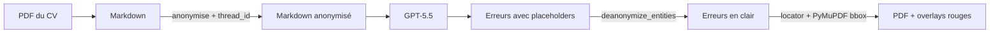

## TL;DR

Un proofreader de CV doit comprendre du texte (donc parler à un LLM) **et** ne jamais exposer les données perso de la personne. C'est la tension que ce projet — `piighost-proofreader` — résout.

Le pipeline fait quatre choses dans l'ordre :



> 📸 *(screenshot du rendu final ici — voir Task 8)*

Le LLM ne voit jamais un seul nom, une seule date de naissance, un seul employeur. À la sortie, les corrections atterrissent au bon mot sur le bon PDF.

Et entre les deux, j'ai dû résoudre trois trucs vicieux. C'est l'objet de cet article.

## 1. La promesse naïve qui tombe vite à plat

Le réflexe, c'est de dire *« anonymiser un CV, c'est un regex sur les emails et les numéros de téléphone »*. C'est faux pour trois raisons concrètes :

- **Les prénoms sont ambigus.** « Paul » est un prénom, mais c'est aussi un fragment de « Saint-Paul-lès-Romans ». Une regex ne fait pas la différence ; un détecteur entraîné, si.
- **Les employeurs n'ont pas de format unique.** « Orange », « SNCF », « Cabinet Lefèvre & Associés » ne se laissent pas attraper par un pattern.
- **Surtout : il faut de la cohérence.** Si « Patrick » apparaît quatre fois dans le CV, il doit devenir le *même* placeholder à chaque fois. Sinon le LLM voit `<<PERSON:1>>` à un endroit et `<<PERSON:7>>` à l'autre et se persuade qu'il y a deux personnes différentes — l'inférence se casse silencieusement.

Cette dernière contrainte, c'est ce qui m'a fait sortir du regex. `piighost` la résout en mappant chaque entité détectée à un placeholder stable dans un cache Redis, scopé par `thread_id` (une UUID par upload de CV) :

```python
# src/proofreader/anonymize.py
async def anonymize(self, text: str, *, thread_id: str) -> str:
    return await self._call(
        "/v1/anonymize", text, thread_id, response_key="anonymized_text"
    )
```

Le `thread_id` est la clé qui rend l'anonymisation déterministe pour une session : la même valeur passée à l'`anonymize` initial puis aux appels de `deanonymize` partage le mapping côté serveur. C'est ce qui permet à un LLM de raisonner correctement sur des entités masquées sans savoir qui elles sont.

<!-- Section 2 — Le piège deanonymize entities -->

<!-- Section 3 — Le locator -->

<!-- Section 4 — Bilan + CTA -->
