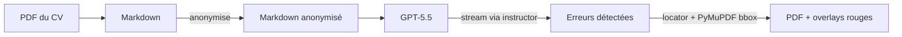
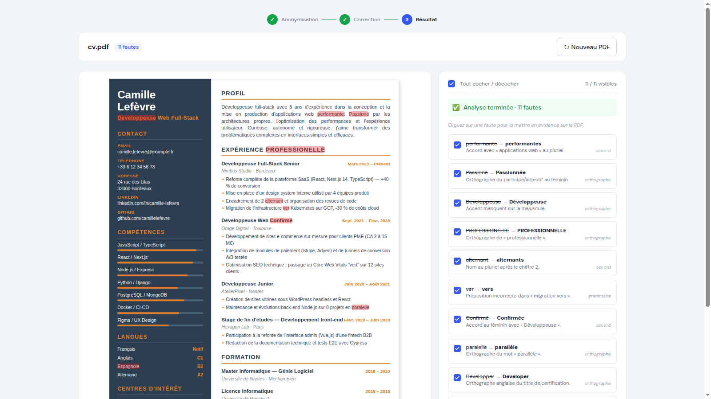

## TL;DR

Pour relire votre CV avant un envoi important, vous pouvez le confier à un LLM. Quelques secondes, et vous avez une liste de fautes. Sauf que vous venez aussi de donner votre nom, votre adresse, vos employeurs et vos dates à un service tiers.

`piighost-proofreader` résout ça. Le CV est anonymisé localement avant l'appel au LLM, et les corrections retrouvent leur place sur le PDF d'origine :





Le LLM ne voit jamais un nom, une date, une adresse.

L'anonymisation, c'est la partie facile. Le morceau pénible, c'est de retrouver dans le PDF un mot que le LLM n'a vu qu'en Markdown. Et le LLM et PyMuPDF ne tokenisent pas pareil.

## 1. Pourquoi pas juste une regex ?

Première idée : avant d'envoyer le CV au LLM, on remplace les données sensibles par une bonne grosse regex. Ça marche pour les emails et les numéros de téléphone, qui ont un format reconnaissable. Pour le reste, c'est mort.

- Un nom n'a aucune forme syntaxique distinctive. `Paul Martin` ressemble à n'importe quels deux mots capitalisés ; rien dans le texte ne dit à une regex que c'est un nom.
- `Orange` est une entreprise. C'est aussi un fruit. `Mars`, `Apple`, `Carrefour`, pareil.
- Une date dans un CV peut être une naissance, un diplôme, un changement de poste. Le format est le même.

Il faut un détecteur entraîné, pas un pattern. `piighost` en fournit un, et l'appel ressemble à ça :

```python
# src/proofreader/anonymize.py
async def anonymize(self, text: str, *, thread_id: str) -> str:
    return await self._call(
        "/v1/anonymize", text, thread_id, response_key="anonymized_text"
    )
```

Le `thread_id` est une UUID par CV. Le mapping entité→placeholder reste côté serveur, isolé par cet ID : un même nom devient le même placeholder à chaque occurrence.

## 2. Streamer les erreurs avec `instructor`

Un CV de deux pages contient une bonne quinzaine de fautes, et le LLM prend plusieurs secondes pour les sortir. Sans streaming, l'utilisateur fixe un loader pendant tout ce temps. Avec, les fautes apparaissent une par une au fur et à mesure que le modèle les émet.

Le piège : la plupart des libs de structured output (LangChain `with_structured_output`, OpenAI Functions, Pydantic AI) renvoient le résultat *complet*. Vous demandez un `list[Mistake]`, vous recevez la liste entière une fois l'inférence terminée. Pas de granularité objet par objet.

`instructor` règle exactement ce cas. Sa méthode `create_iterable` parse le JSON streamé par le LLM au fil de l'eau et renvoie chaque objet pydantic dès qu'il est complet :

```python
# src/proofreader/llm.py
client = instructor.from_litellm(litellm.acompletion)
response = client.chat.completions.create_iterable(
    model=model,
    response_model=Mistake,   # un seul objet, pas list[Mistake]
    messages=[
        {"role": "system", "content": SYSTEM_PROMPT_STREAM.format(language=language)},
        {"role": "user", "content": markdown},
    ],
)
async for mistake in response:
    yield mistake
```

Deux complications qui ne sautent pas aux yeux :

1. **Le prompt change selon le mode.** Pour un `with_structured_output` LangChain, on demande au LLM de renvoyer un objet wrapper avec une liste de Mistakes dedans. Pour `create_iterable`, on lui demande d'émettre un seul Mistake JSON par tour de génération. Les deux prompts ne sont pas tout à fait les mêmes. Le projet maintient les deux côte à côte : LangChain pour le chemin Streamlit one-shot, `instructor` pour le streaming FastAPI.

2. **Le streaming SSE en aval.** Chaque `Mistake` émis est immédiatement repackagé en event Server-Sent Events côté FastAPI, puis envoyé au frontend. Le locator de la section suivante tourne *par-Mistake*, donc l'utilisateur voit chaque rectangle rouge apparaître au fur et à mesure, pas en bloc à la fin.

## 3. Le retour sur PDF : quatre stratégies de fallback

Pour chaque `Mistake` qu'`instructor` renvoie, j'ai un `error_text`, un `correction`, un `context_before`, et une `description`. Le LLM, lui, n'a jamais vu un seul pixel du PDF : il travaillait sur le Markdown extrait. Aucun champ ne contient des coordonnées.

Or l'utilisateur veut voir les corrections sur le PDF d'origine, pas un texte plat dans une page de résultats. Donc il faut, pour chaque erreur, retrouver le mot dans le PDF.

Du côté PDF, j'utilise PyMuPDF, qui me donne un *word stream* : la liste de tous les mots de la page avec leurs `bbox` (rectangles en points). Le problème devient : trouver la fenêtre `[mot1, mot2, …]` dans cette liste. Sauf que le LLM et PyMuPDF ne tokenisent pas pareil, que les apostrophes typographiques ne sont pas alignées, et que sur un CV en deux colonnes le LLM hallucine parfois son `context_before`.

D'où quatre stratégies essayées dans l'ordre. Chacune rattrape un cas que la précédente ne sait pas gérer :

```python
# src/proofreader/locator.py
def locate_mistake(mistake: Mistake, *, words: list[Word]) -> LocatedMistake | None:
    err_tokens = mistake.error_text.split()
    if not err_tokens:
        return None
    ctx_tokens = mistake.context_before.split()

    # Strategy 1: strict whole-word match.
    matched = _match_window(ctx_tokens, err_tokens, words, normalize=False)
    if matched is not None:
        return _build_located(mistake, matched)

    # Strategy 2: punctuation-tolerant (casefold + ASCII quotes + strip punct).
    matched = _match_window(ctx_tokens, err_tokens, words, normalize=True)
    if matched is not None:
        return _build_located(mistake, matched)

    # Strategy 3: error_text alone if it appears exactly once on the page.
    # Catches LLM context drift in multi-column layouts.
    matched = _find_error_alone_if_unique(err_tokens, words)
    if matched is not None:
        return _build_located(mistake, matched)

    # Strategy 4: substring of the concatenated normalised stream. Handles LLM
    # tokenisation drift like `d'une` → `d' + une`, where the standalone word
    # has no PyMuPDF token equivalent.
    matched = _find_error_as_substring_if_unique(err_tokens, words)
    if matched is not None:
        return _build_located(mistake, matched)

    return None
```

Pourquoi cet ordre exact :

1. **Strict.** La fenêtre `context_before + error_text` correspond au mot près, sans normalisation. Le cas heureux : le LLM cite le PDF parfaitement, correspondance exacte, zéro ambiguïté.

2. **Tolérant.** Le LLM capitalise le premier mot d'une phrase, ou remplace `'` par `'` (apostrophe typographique). `_normalize` casefold le tout, remplace les guillemets et apostrophes typographiques par leur version ASCII, et retire la ponctuation que PyMuPDF colle aux tokens.

3. **Error-only unique.** Sur les CVs en deux colonnes, le `context_before` que le LLM produit est parfois pioché dans la *mauvaise* colonne (les modèles linéarisent maladroitement le multi-colonne). Si l'`error_text` n'apparaît qu'une fois sur la page, on prend, peu importe le contexte. Ça suffit dans la quasi-totalité des cas.

4. **Substring du stream concaténé.** Cas tordu : `d'une` est un mot pour le LLM, mais PyMuPDF le tokenise en `d'` + `une`. Le LLM peut renvoyer `error_text="une"` comme mot isolé, sans token PyMuPDF correspondant. Solution : concaténer tous les tokens de la page en une seule chaîne et chercher en sous-chaîne. On filtre par `_MIN_SUBSTRING_CHARS = 5`, parce que sans ça un `error_text="une"` se retrouve dans `commune`, `lacune`, `tribune`. Bonjour les faux positifs.

Si aucune des quatre n'attrape rien, l'erreur passe dans une section *« Non localisées »* du résultat plutôt que d'être silencieusement perdue. Une erreur visible que l'utilisateur peut lire mais qui n'a pas son rectangle rouge, c'est moins grave qu'une erreur dont on prétend qu'elle est ailleurs.

## Bilan

Si vous bricolez quelque chose de similaire, trois choses à retenir :

1. Une regex ne détecte pas les noms, entreprises ou dates. Il faut un détecteur entraîné.
2. Si vous voulez streamer du structured output (objets pydantic au fil de l'eau, pas la liste entière à la fin), les libs habituelles ne suffisent pas. `instructor` est conçu pour ça.
3. Si le LLM travaille sur du texte extrait d'un document (PDF, OCR, scans), il vous rend des erreurs sans coordonnées. Vous devez les relocaliser après coup, et accepter que ce ne soit pas toujours possible.

`piighost` règle le premier point. `instructor` règle le deuxième. Le troisième m'a fait écrire ce projet, dont le code est ouvert.

- **piighost** : [github.com/Athroniaeth/piighost](https://github.com/Athroniaeth/piighost), la lib d'anonymisation utilisée ici.
- **piighost-proofreader** : [github.com/Athroniaeth/piighost-proofreader](https://github.com/Athroniaeth/piighost-proofreader), le projet complet, démo en ligne, locator inclus.

Issues et PR bienvenues. Si vous travaillez sur du texte privé avec un LLM, les trois points ci-dessus vont probablement vous parler.

<!--
SCREENSHOT: docs/blog/assets/2026-05-26-cv-result-desktop.png (already captured, 1600x900).
Before publishing on dev.to: drag-drop the PNG into the dev.to editor so Forem hosts it,
then replace the relative ./assets/... path above with the dev.to-hosted URL.
-->
