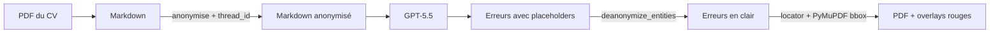

## TL;DR

Un proofreader de CV doit comprendre du texte (donc parler à un LLM) **et** ne jamais exposer les données perso de la personne. C'est la tension que ce projet — `piighost-proofreader` — résout.

Le pipeline fait quatre choses dans l'ordre :

> 📸 *(screenshot du rendu final ici — voir Task 8)*

Le LLM ne voit jamais un seul nom, une seule date de naissance, un seul employeur. À la sortie, les corrections atterrissent au bon mot sur le bon PDF.

Et entre les deux, j'ai dû résoudre trois trucs vicieux. C'est l'objet de cet article.

<!-- Section 1 — La promesse naïve -->

<!-- Section 2 — Le piège deanonymize entities -->

<!-- Section 3 — Le locator -->

<!-- Section 4 — Bilan + CTA -->
