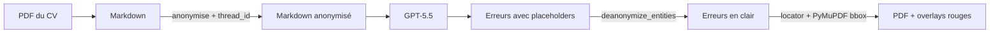

## TL;DR

Un proofreader de CV doit comprendre du texte (donc parler à un LLM) **et** ne jamais exposer les données perso de la personne. C'est la tension que ce projet — `piighost-proofreader` — résout.

Le pipeline fait quatre choses dans l'ordre :



> 📸 *(screenshot du rendu final ici — voir Task 8)*

Le LLM ne voit jamais un seul nom, une seule date de naissance, un seul employeur. À la sortie, les corrections atterrissent au bon mot sur le bon PDF.

Et entre les deux, j'ai dû résoudre trois trucs vicieux. C'est l'objet de cet article.

## 1. La promesse naïve qui tombe vite à plat

Le réflexe, c'est de dire *« anonymiser un CV, c'est un regex sur les emails et les numéros de téléphone »*. C'est faux pour trois raisons concrètes :

- **Les prénoms sont ambigus.** « Paul » est un prénom, mais c'est aussi un fragment de « Saint-Paul-lès-Romans ». Une regex ne fait pas la différence ; un détecteur entraîné, si.
- **Les employeurs n'ont pas de format unique.** « Orange », « SNCF », « Cabinet Lefèvre & Associés » ne se laissent pas attraper par un pattern.
- **Surtout : il faut de la cohérence.** Si « Patrick » apparaît quatre fois dans le CV, il doit devenir le *même* placeholder à chaque fois. Sinon le LLM voit `<<PERSON:1>>` à un endroit et `<<PERSON:7>>` à l'autre et se persuade qu'il y a deux personnes différentes — l'inférence se casse silencieusement.

Cette dernière contrainte, c'est ce qui m'a fait sortir du regex. `piighost` la résout en mappant chaque entité détectée à un placeholder stable dans un cache Redis, scopé par `thread_id` (une UUID par upload de CV) :

```python
# src/proofreader/anonymize.py
async def anonymize(self, text: str, *, thread_id: str) -> str:
    return await self._call(
        "/v1/anonymize", text, thread_id, response_key="anonymized_text"
    )
```

Le `thread_id` est la clé qui rend l'anonymisation déterministe pour une session : la même valeur passée à l'`anonymize` initial puis aux appels de `deanonymize` partage le mapping côté serveur. C'est ce qui permet à un LLM de raisonner correctement sur des entités masquées sans savoir qui elles sont.

## 2. Le piège du « le LLM ne renvoie pas ce qu'on lui a donné »

Une fois le Markdown anonymisé envoyé au LLM, on s'attend à recevoir des corrections truffées de `<<PERSON:1>>`, `<<EMAIL:3>>`, et il *« suffit »* de re-substituer pour finir. C'est ce que j'ai fait au premier essai.

Premier appel à `/v1/deanonymize` → **404 Not Found**.

Pourquoi ? Parce que le LLM ne renvoie *pas* le texte anonymisé en intégralité. Le schéma de sortie structuré demande, pour chaque erreur, des champs comme `error_text`, `context_before`, `correction`, `description`. Le LLM y met des **sous-extraits** : 5 mots ici, une phrase paraphrasée là, parfois avec une virgule déplacée. Aucun de ces champs n'est verbatim l'anonymisé.

Or `/v1/deanonymize` est cache-keyed sur le hash du texte anonymisé complet — il sait dé-anonymiser ce qu'il a anonymisé, mais pas un sous-extrait qu'il n'a jamais vu. D'où le 404.

`piighost` expose un deuxième endpoint pour exactement ce cas : `/v1/deanonymize/entities`. Au lieu de chercher la clé du texte complet, il fait un remplacement par entité présente dans le sous-extrait (les `<<LABEL:N>>` qu'il y trouve sont résolus contre le mapping du `thread_id`).

```python
# src/proofreader/anonymize.py
async def deanonymize(self, text: str, *, thread_id: str) -> str:
    # /v1/deanonymize/entities does token-based replacement on any text,
    # while /v1/deanonymize is cache-keyed on the full anonymized text
    # and 404s on substrings. We pass substrings (Mistake.error_text,
    # context_before, correction, description), so we need the entity
    # endpoint.
    return await self._call(
        "/v1/deanonymize/entities", text, thread_id, response_key="text"
    )
```

Concrètement, pour chaque `Mistake` que le LLM renvoie, je rappelle `deanonymize` sur chacun de ses quatre champs textuels. C'est plus de round-trips, mais c'est ce qui rend le pipeline robuste aux paraphrasages.

**À retenir** : quand tu fais passer du texte anonymisé dans un LLM, le « retour » de l'anonymisation doit pouvoir gérer des **fragments** du texte original, pas le texte entier. Si ton outil d'anonymisation ne fait pas la distinction, tu vas hit ce mur.

## 3. Le retour sur PDF : quatre stratégies de fallback

À ce stade, j'ai pour chaque erreur un `error_text` en clair (post-deanon), un `correction`, un `context_before`, et une `description`. Le LLM, lui, n'a jamais vu un seul pixel du PDF : il travaillait sur le Markdown extrait. Aucun champ ne contient des coordonnées.

Or l'utilisateur veut **voir** les corrections sur le PDF d'origine — pas un texte plat dans une page de résultats. Donc il faut, pour chaque erreur, retrouver le mot dans le PDF.

Du côté du PDF, j'utilise PyMuPDF, qui me donne un *word stream* : la liste de tous les mots de la page avec leurs `bbox` (rectangles en points). Le problème devient : *« trouver la fenêtre `[mot1, mot2, …]` dans cette liste »*. Sauf que le LLM et PyMuPDF tokenisent légèrement différemment, qu'il y a des apostrophes typographiques qui drifent, et que sur les CVs multi-colonnes le LLM hallucine parfois son `context_before`.

D'où quatre stratégies essayées en cascade, chacune absorbant un mode d'échec spécifique de la précédente :

```python
# src/proofreader/locator.py
def locate_mistake(mistake: Mistake, *, words: list[Word]) -> LocatedMistake | None:
    err_tokens = mistake.error_text.split()
    if not err_tokens:
        return None
    ctx_tokens = mistake.context_before.split()

    # Strategy 1: strict whole-word match.
    matched = _match_window(ctx_tokens, err_tokens, words, normalize=False)
    if matched is not None:
        return _build_located(mistake, matched)

    # Strategy 2: punctuation-tolerant (casefold + ASCII quotes + strip punct).
    matched = _match_window(ctx_tokens, err_tokens, words, normalize=True)
    if matched is not None:
        return _build_located(mistake, matched)

    # Strategy 3: error_text alone if it appears exactly once on the page.
    # Catches LLM context drift in multi-column layouts.
    matched = _find_error_alone_if_unique(err_tokens, words)
    if matched is not None:
        return _build_located(mistake, matched)

    # Strategy 4: substring of the concatenated normalised stream. Handles LLM
    # tokenisation drift like `d'une` → `d' + une`, where the standalone word
    # has no PyMuPDF token equivalent.
    matched = _find_error_as_substring_if_unique(err_tokens, words)
    if matched is not None:
        return _build_located(mistake, matched)

    return None
```

Pourquoi cet ordre exact :

1. **Strict.** La fenêtre `context_before + error_text` matche au mot près, sans normalisation. C'est le cas heureux : le LLM cite le PDF parfaitement, on évite les faux positifs. Quand ça marche, on a la confiance maximale.

2. **Tolérant.** Le LLM capitalise le premier mot d'une phrase, ou remplace `'` par `'` (apostrophe typographique). `_normalize` casefold le tout, remappe les guillemets et apostrophes typographiques vers leur version ASCII, et strippe la ponctuation que PyMuPDF colle aux tokens.

3. **Error-only unique.** Sur les CVs en deux colonnes, le `context_before` que le LLM produit est parfois pioché dans la *mauvaise* colonne (les modèles linéarisent maladroitement le multi-colonne). Si l'`error_text` n'apparaît qu'une fois sur la page, on prend, peu importe le contexte — c'est statistiquement sûr.

4. **Substring du stream concaténé.** Cas tordu : `d'une` est un mot pour le LLM, mais PyMuPDF le tokenise en `d'` + `une`. Le LLM peut renvoyer `error_text="une"` comme mot isolé, sans token PyMuPDF correspondant. Solution : concaténer tous les tokens de la page en une seule string et chercher en sous-chaîne. **Gated** par `_MIN_SUBSTRING_CHARS = 5`, parce que sans ça un `error_text="une"` matche dans `commune`, `lacune`, `tribune` — bonjour les faux positifs.

Si aucune des quatre ne matche, l'erreur passe dans une section *« Non localisées »* du résultat plutôt que d'être silencieusement perdue. Une erreur visible que l'utilisateur peut lire mais qui n'a pas son rectangle rouge, c'est moins grave qu'une erreur dont on prétend qu'elle est ailleurs.

<!-- Section 4 — Bilan + CTA -->
