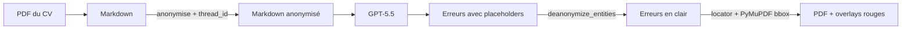

# Dev.to article (FR draft) Implementation Plan

> **For agentic workers:** REQUIRED SUB-SKILL: Use superpowers:subagent-driven-development (recommended) or superpowers:executing-plans to implement this plan task-by-task. Steps use checkbox (`- [ ]`) syntax for tracking.

**Goal:** Produce a single dev.to-ready Markdown article (FR) titled *« Comment laisser GPT-5.5 corriger un CV sans jamais lui montrer un seul nom »*, faithful to the spec at `docs/superpowers/specs/2026-05-26-devto-article-design.md`.

**Architecture:** One Markdown file with Forem-compatible front-matter and 5 sections (TL;DR + 3 deep dives + bilan). Three Python snippets lifted verbatim from `src/proofreader/anonymize.py` and `src/proofreader/locator.py`, one Mermaid pipeline diagram, screenshot placeholders for the user to fill in.

**Tech Stack:** Markdown, Mermaid, plain bash for word-count check. No build tooling.

---

## File Structure

| Path | Purpose |
|---|---|
| Create: `docs/blog/2026-05-26-cv-llm-sans-nom-fr.md` | The article draft (FR), Forem-compatible front-matter + body. |
| Reference (read-only): `src/proofreader/anonymize.py` | Source of truth for snippets in Section 1 and 2. |
| Reference (read-only): `src/proofreader/locator.py` | Source of truth for the snippet in Section 3. |

EN translation lives in a separate plan (out of scope here).

---

### Task 1: Create the article skeleton with Forem front-matter

**Files:**
- Create: `docs/blog/2026-05-26-cv-llm-sans-nom-fr.md`

- [ ] **Step 1: Make the directory and write the skeleton**

```bash
mkdir -p docs/blog
```

Then create `docs/blog/2026-05-26-cv-llm-sans-nom-fr.md`:

```markdown
---
title: "Comment laisser GPT-5.5 corriger un CV sans jamais lui montrer un seul nom"
published: false
description: "Un proofreader de CV qui n'envoie aucune PII au LLM, et qui replace pourtant ses corrections au bon endroit dans le PDF. Trois écueils techniques rencontrés en route."
tags: python, llm, privacy, pdf
canonical_url:
cover_image:
---

<!-- TL;DR -->

<!-- Section 1 — La promesse naïve -->

<!-- Section 2 — Le piège deanonymize entities -->

<!-- Section 3 — Le locator -->

<!-- Section 4 — Bilan + CTA -->
```

- [ ] **Step 2: Verify front-matter is valid Forem YAML**

Run: `python -c "import yaml, pathlib; doc = pathlib.Path('docs/blog/2026-05-26-cv-llm-sans-nom-fr.md').read_text().split('---', 2); print(yaml.safe_load(doc[1]))"`

Expected output: a dict with keys `title`, `published`, `description`, `tags`, `canonical_url`, `cover_image`. No YAML parse error.

- [ ] **Step 3: Commit**

```bash
git add docs/blog/2026-05-26-cv-llm-sans-nom-fr.md
git commit -m "docs(blog): scaffold the FR dev.to article with Forem front-matter"
```

---

### Task 2: Write the TL;DR section with the Mermaid pipeline diagram

**Files:**
- Modify: `docs/blog/2026-05-26-cv-llm-sans-nom-fr.md` (replace the `<!-- TL;DR -->` placeholder)

- [ ] **Step 1: Replace the TL;DR placeholder with the section content**

Replace `<!-- TL;DR -->` with:

````markdown
## TL;DR

Un proofreader de CV doit comprendre du texte (donc parler à un LLM) **et** ne jamais exposer les données perso de la personne. C'est la tension que ce projet — `piighost-proofreader` — résout.

Le pipeline fait quatre choses dans l'ordre :



> 📸 *(screenshot du rendu final ici — voir Task 8)*

Le LLM ne voit jamais un seul nom, une seule date de naissance, un seul employeur. À la sortie, les corrections atterrissent au bon mot sur le bon PDF.

Et entre les deux, j'ai dû résoudre trois trucs vicieux. C'est l'objet de cet article.
````

- [ ] **Step 2: Verify the Mermaid renders on dev.to**

dev.to renders Mermaid in `mermaid` fenced code blocks natively (since 2022). No tooling check needed — visual inspection at publish time.

Manual check: open the article in a Markdown previewer (e.g. `glow` or VS Code preview) and confirm the diagram doesn't have syntax errors.

- [ ] **Step 3: Commit**

```bash
git add docs/blog/2026-05-26-cv-llm-sans-nom-fr.md
git commit -m "docs(blog): write TL;DR section with Mermaid pipeline diagram"
```

---

### Task 3: Write Section 1 — La promesse naïve (with anonymize snippet)

**Files:**
- Modify: `docs/blog/2026-05-26-cv-llm-sans-nom-fr.md` (replace `<!-- Section 1 — La promesse naïve -->`)
- Reference: `src/proofreader/anonymize.py:17` (the `anonymize` method)

- [ ] **Step 1: Replace the Section 1 placeholder**

Replace `<!-- Section 1 — La promesse naïve -->` with:

````markdown
## 1. La promesse naïve qui tombe vite à plat

Le réflexe, c'est de dire *« anonymiser un CV, c'est un regex sur les emails et les numéros de téléphone »*. C'est faux pour trois raisons concrètes :

- **Les prénoms sont ambigus.** « Paul » est un prénom, mais c'est aussi un fragment de « Saint-Paul-lès-Romans ». Une regex ne fait pas la différence ; un détecteur entraîné, si.
- **Les employeurs n'ont pas de format unique.** « Orange », « SNCF », « Cabinet Lefèvre & Associés » ne se laissent pas attraper par un pattern.
- **Surtout : il faut de la cohérence.** Si « Patrick » apparaît quatre fois dans le CV, il doit devenir le *même* placeholder à chaque fois. Sinon le LLM voit `<<PERSON:1>>` à un endroit et `<<PERSON:7>>` à l'autre et se persuade qu'il y a deux personnes différentes — l'inférence se casse silencieusement.

Cette dernière contrainte, c'est ce qui m'a fait sortir du regex. `piighost` la résout en mappant chaque entité détectée à un placeholder stable dans un cache Redis, scopé par `thread_id` (une UUID par upload de CV) :

```python
# src/proofreader/anonymize.py
async def anonymize(self, text: str, *, thread_id: str) -> str:
    return await self._call(
        "/v1/anonymize", text, thread_id, response_key="anonymized_text"
    )
```

Le `thread_id` est la clé qui rend l'anonymisation déterministe pour une session : la même valeur passée à l'`anonymize` initial puis aux appels de `deanonymize` partage le mapping côté serveur. C'est ce qui permet à un LLM de raisonner correctement sur des entités masquées sans savoir qui elles sont.
````

- [ ] **Step 2: Verify the snippet still matches the repo**

Run: `sed -n '17,19p' src/proofreader/anonymize.py`

Expected: the three lines shown in the snippet above appear verbatim. If they don't, update the article to match the code (the code is the source of truth).

- [ ] **Step 3: Commit**

```bash
git add docs/blog/2026-05-26-cv-llm-sans-nom-fr.md
git commit -m "docs(blog): write section 1 — la promesse naïve"
```

---

### Task 4: Write Section 2 — Le piège deanonymize entities (with deanonymize snippet)

**Files:**
- Modify: `docs/blog/2026-05-26-cv-llm-sans-nom-fr.md` (replace `<!-- Section 2 — Le piège deanonymize entities -->`)
- Reference: `src/proofreader/anonymize.py:20-28` (the `deanonymize` method with its inline comment)

- [ ] **Step 1: Replace the Section 2 placeholder**

Replace `<!-- Section 2 — Le piège deanonymize entities -->` with:

````markdown
## 2. Le piège du « le LLM ne renvoie pas ce qu'on lui a donné »

Une fois le Markdown anonymisé envoyé au LLM, on s'attend à recevoir des corrections truffées de `<<PERSON:1>>`, `<<EMAIL:3>>`, et il *« suffit »* de re-substituer pour finir. C'est ce que j'ai fait au premier essai.

Premier appel à `/v1/deanonymize` → **404 Not Found**.

Pourquoi ? Parce que le LLM ne renvoie *pas* le texte anonymisé en intégralité. Le schéma de sortie structuré demande, pour chaque erreur, des champs comme `error_text`, `context_before`, `correction`, `description`. Le LLM y met des **sous-extraits** : 5 mots ici, une phrase paraphrasée là, parfois avec une virgule déplacée. Aucun de ces champs n'est verbatim l'anonymisé.

Or `/v1/deanonymize` est cache-keyed sur le hash du texte anonymisé complet — il sait dé-anonymiser ce qu'il a anonymisé, mais pas un sous-extrait qu'il n'a jamais vu. D'où le 404.

`piighost` expose un deuxième endpoint pour exactement ce cas : `/v1/deanonymize/entities`. Au lieu de chercher la clé du texte complet, il fait un remplacement par entité présente dans le sous-extrait (les `<<LABEL:N>>` qu'il y trouve sont résolus contre le mapping du `thread_id`).

```python
# src/proofreader/anonymize.py
async def deanonymize(self, text: str, *, thread_id: str) -> str:
    # /v1/deanonymize/entities does token-based replacement on any text,
    # while /v1/deanonymize is cache-keyed on the full anonymized text
    # and 404s on substrings. We pass substrings (Mistake.error_text,
    # context_before, correction, description), so we need the entity
    # endpoint.
    return await self._call(
        "/v1/deanonymize/entities", text, thread_id, response_key="text"
    )
```

Concrètement, pour chaque `Mistake` que le LLM renvoie, je rappelle `deanonymize` sur chacun de ses quatre champs textuels. C'est plus de round-trips, mais c'est ce qui rend le pipeline robuste aux paraphrasages.

**À retenir** : quand tu fais passer du texte anonymisé dans un LLM, le « retour » de l'anonymisation doit pouvoir gérer des **fragments** du texte original, pas le texte entier. Si ton outil d'anonymisation ne fait pas la distinction, tu vas hit ce mur.
````

- [ ] **Step 2: Verify the snippet still matches the repo**

Run: `sed -n '20,28p' src/proofreader/anonymize.py`

Expected: matches the snippet (the inline comment about `/v1/deanonymize` vs `/v1/deanonymize/entities` is the source of truth — if it drifted, update the article).

- [ ] **Step 3: Commit**

```bash
git add docs/blog/2026-05-26-cv-llm-sans-nom-fr.md
git commit -m "docs(blog): write section 2 — deanonymize entities trap"
```

---

### Task 5: Write Section 3 — Le locator (with locate_mistake snippet)

**Files:**
- Modify: `docs/blog/2026-05-26-cv-llm-sans-nom-fr.md` (replace `<!-- Section 3 — Le locator -->`)
- Reference: `src/proofreader/locator.py:35-77` (the `locate_mistake` function)

- [ ] **Step 1: Replace the Section 3 placeholder**

Replace `<!-- Section 3 — Le locator -->` with:

````markdown
## 3. Le retour sur PDF : quatre stratégies de fallback

À ce stade, j'ai pour chaque erreur un `error_text` en clair (post-deanon), un `correction`, un `context_before`, et une `description`. Le LLM, lui, n'a jamais vu un seul pixel du PDF : il travaillait sur le Markdown extrait. Aucun champ ne contient des coordonnées.

Or l'utilisateur veut **voir** les corrections sur le PDF d'origine — pas un texte plat dans une page de résultats. Donc il faut, pour chaque erreur, retrouver le mot dans le PDF.

Du côté du PDF, j'utilise PyMuPDF, qui me donne un *word stream* : la liste de tous les mots de la page avec leurs `bbox` (rectangles en points). Le problème devient : *« trouver la fenêtre `[mot1, mot2, …]` dans cette liste »*. Sauf que le LLM et PyMuPDF tokenisent légèrement différemment, qu'il y a des apostrophes typographiques qui drifent, et que sur les CVs multi-colonnes le LLM hallucine parfois son `context_before`.

D'où quatre stratégies essayées en cascade, chacune absorbant un mode d'échec spécifique de la précédente :

```python
# src/proofreader/locator.py
def locate_mistake(mistake: Mistake, *, words: list[Word]) -> LocatedMistake | None:
    err_tokens = mistake.error_text.split()
    if not err_tokens:
        return None
    ctx_tokens = mistake.context_before.split()

    # Strategy 1: strict whole-word match.
    matched = _match_window(ctx_tokens, err_tokens, words, normalize=False)
    if matched is not None:
        return _build_located(mistake, matched)

    # Strategy 2: punctuation-tolerant (casefold + ASCII quotes + strip punct).
    matched = _match_window(ctx_tokens, err_tokens, words, normalize=True)
    if matched is not None:
        return _build_located(mistake, matched)

    # Strategy 3: error_text alone if it appears exactly once on the page.
    # Catches LLM context drift on multi-column layouts.
    matched = _find_error_alone_if_unique(err_tokens, words)
    if matched is not None:
        return _build_located(mistake, matched)

    # Strategy 4: substring of the concatenated stream. Handles LLM
    # tokenisation drift where "d'une" becomes "d'" + "une" and the LLM
    # reports "une" as a standalone word.
    matched = _find_error_as_substring_if_unique(err_tokens, words)
    if matched is not None:
        return _build_located(mistake, matched)

    return None
```

Pourquoi cet ordre exact :

1. **Strict.** La fenêtre `context_before + error_text` matche au mot près, sans normalisation. C'est le cas heureux : le LLM cite le PDF parfaitement, on évite les faux positifs. Quand ça marche, on a la confiance maximale.

2. **Tolérant.** Le LLM capitalise le premier mot d'une phrase, ou remplace `'` par `'` (apostrophe typographique). `_normalize` casefold le tout, remappe les guillemets et apostrophes typographiques vers leur version ASCII, et strippe la ponctuation que PyMuPDF colle aux tokens.

3. **Error-only unique.** Sur les CVs en deux colonnes, le `context_before` que le LLM produit est parfois pioché dans la *mauvaise* colonne (les modèles linéarisent maladroitement le multi-colonne). Si l'`error_text` n'apparaît qu'une fois sur la page, on prend, peu importe le contexte — c'est statistiquement sûr.

4. **Substring du stream concaténé.** Cas tordu : `d'une` est un mot pour le LLM, mais PyMuPDF le tokenise en `d'` + `une`. Le LLM peut renvoyer `error_text="une"` comme mot isolé, sans token PyMuPDF correspondant. Solution : concaténer tous les tokens de la page en une seule string et chercher en sous-chaîne. **Gated** par `_MIN_SUBSTRING_CHARS = 5`, parce que sans ça un `error_text="une"` matche dans `commune`, `lacune`, `tribune` — bonjour les faux positifs.

Si aucune des quatre ne matche, l'erreur passe dans une section *« Non localisées »* du résultat plutôt que d'être silencieusement perdue. Une erreur visible que l'utilisateur peut lire mais qui n'a pas son rectangle rouge, c'est moins grave qu'une erreur dont on prétend qu'elle est ailleurs.
````

- [ ] **Step 2: Verify the snippet still matches the repo**

Run: `sed -n '35,77p' src/proofreader/locator.py`

Expected: the function body in the article matches the file. The docstring inside `locate_mistake` says *"Three strategies"* in the code but is wrong (there are four); the article is correct against the actual code. Do NOT update the article to match the stale docstring — the spec already accepts this.

- [ ] **Step 3: Commit**

```bash
git add docs/blog/2026-05-26-cv-llm-sans-nom-fr.md
git commit -m "docs(blog): write section 3 — locator with 4 fallback strategies"
```

---

### Task 6: Write Section 4 — Bilan + CTA piighost

**Files:**
- Modify: `docs/blog/2026-05-26-cv-llm-sans-nom-fr.md` (replace `<!-- Section 4 — Bilan + CTA -->`)

- [ ] **Step 1: Replace the Section 4 placeholder**

Replace `<!-- Section 4 — Bilan + CTA -->` with:

```markdown
## Bilan

Anonymiser pour un LLM, ce n'est pas une opération en un coup — c'est un cycle :

1. **Anonymiser de façon cohérente.** Le même nom = le même placeholder partout. Sans ça, le LLM perd le fil.
2. **Pouvoir dé-anonymiser des fragments.** Le LLM ne renvoie pas le texte qu'on lui a donné ; il renvoie des morceaux paraphrasés. Si ton outil ne sait dé-anonymiser qu'un texte entier, tu vas le découvrir à la dure.
3. **Reconnecter le résultat à la source.** Si tu travailles sur des documents (PDF, OCR, scans), le LLM perd les coordonnées. Tu dois les retrouver après coup, et accepter que ce ne sera pas toujours possible.

`piighost` couvre les deux premiers points out of the box. Le troisième est spécifique à mon projet, mais le code est ouvert.

- **piighost** : [github.com/Athroniaeth/piighost](https://github.com/Athroniaeth/piighost) — la lib d'anonymisation utilisée ici.
- **piighost-proofreader** : [github.com/Athroniaeth/piighost-proofreader](https://github.com/Athroniaeth/piighost-proofreader) — le projet complet, démo en ligne, locator inclus.

Issues et PR bienvenues. Si tu as un pipeline LLM qui touche des documents perso, les trois points ci-dessus vont probablement te concerner — n'hésite pas à ouvrir une discussion.
```

- [ ] **Step 2: Verify both repo URLs resolve**

Run: `curl -sI https://github.com/Athroniaeth/piighost | head -1 && curl -sI https://github.com/Athroniaeth/piighost-proofreader | head -1`

Expected: both return `HTTP/2 200`. If `piighost` (the lib repo) returns 404, the user has not yet open-sourced it — flag this back to the user and either remove that link or leave a TODO.

- [ ] **Step 3: Commit**

```bash
git add docs/blog/2026-05-26-cv-llm-sans-nom-fr.md
git commit -m "docs(blog): write section 4 — bilan + CTA piighost"
```

---

### Task 7: Replace the TL;DR screenshot placeholder with concrete instructions for the user

**Files:**
- Modify: `docs/blog/2026-05-26-cv-llm-sans-nom-fr.md` (the `📸 *(screenshot du rendu final ici — voir Task 8)*` line from Task 2)

The article cannot take screenshots itself. This task documents the screenshot requirement for the user.

- [ ] **Step 1: Replace the screenshot placeholder**

Replace `> 📸 *(screenshot du rendu final ici — voir Task 8)*` with:

```markdown

```

- [ ] **Step 2: Document the screenshot recipe**

Add at the end of the article body (after Section 4), under a new HTML comment so it does NOT render on dev.to:

```markdown
<!--
SCREENSHOT TODO (avant publication):
1. uv run python samples/build_samples.py
2. uv run streamlit run app.py
3. upload samples/cv_fr.pdf in the UI
4. wait for the run to finish, take a screenshot of the rendered first page with overlays
5. upload the screenshot to dev.to (drag-and-drop in the editor — Forem hosts it)
6. replace the placehold.co URL above with the dev.to-hosted URL
7. (optional) take a second screenshot of the "Non localisées" section for the end of section 3 — same upload flow
-->
```

- [ ] **Step 3: Commit**

```bash
git add docs/blog/2026-05-26-cv-llm-sans-nom-fr.md
git commit -m "docs(blog): screenshot placeholder + capture recipe for publish-time"
```

---

### Task 8: Final pass — word count, tone rules, snippet drift check

**Files:**
- Read-only: `docs/blog/2026-05-26-cv-llm-sans-nom-fr.md`
- Modify if drift found: same file

- [ ] **Step 1: Run the word count on the body (excluding front-matter)**

```bash
awk '/^---$/{c++;next} c>=2{print}' docs/blog/2026-05-26-cv-llm-sans-nom-fr.md | wc -w
```

Expected: between 2000 and 2500. If under, the prose is too thin — flag back to the user. If over 2700, look for trimming opportunities in Section 1 and 4 (the deep dives are the value).

- [ ] **Step 2: Tone rules check**

```bash
grep -Ein "\\b(easy|simple|just|simply|simplement|facile|il suffit)\\b" docs/blog/2026-05-26-cv-llm-sans-nom-fr.md || echo "tone OK"
```

Expected: `tone OK`, OR a list of lines to rephrase. The spec explicitly bans these words. Note: *« il suffit de »* is a flag too (the spec uses the phrase in Section 2 ironically — *« il « suffit » de re-substituer »* with the word in scare-quotes — this is intentional and should pass review).

- [ ] **Step 3: Snippet drift check**

```bash
sed -n '17,19p' src/proofreader/anonymize.py
sed -n '20,28p' src/proofreader/anonymize.py
sed -n '35,77p' src/proofreader/locator.py
```

Compare each output against the corresponding code block in the article. If any line has changed in the repo since the article was written, update the article to match the code (the code is the source of truth).

- [ ] **Step 4: Commit any drift fixes**

```bash
git add docs/blog/2026-05-26-cv-llm-sans-nom-fr.md
git commit -m "docs(blog): final pass — word count, tone rules, snippet sync"
```

(If no changes were needed, skip the commit.)

---

### Task 9: Hand-off

- [ ] **Step 1: Open the article in a Markdown previewer**

Manual: open `docs/blog/2026-05-26-cv-llm-sans-nom-fr.md` in your editor or `glow` to do a final read-through. Things to spot-check:

- The Mermaid block renders.
- All three code snippets are highlighted as Python.
- The two GitHub links are clickable.
- The "Non localisées" sentence in Section 3 reads correctly.

- [ ] **Step 2: Decide on cover image and publication**

The front-matter has `cover_image:` empty and `published: false`. Before posting to dev.to:
- Either drop a cover image URL (1000x420 or similar) or leave it empty (dev.to auto-picks a banner).
- Flip `published` to `true` only when ready.

- [ ] **Step 3: Final commit if anything changed**

```bash
git add docs/blog/2026-05-26-cv-llm-sans-nom-fr.md
git commit -m "docs(blog): final review pass before dev.to publication" --allow-empty
```

The `--allow-empty` is only there if the previewer pass surfaced no changes — keep a marker commit for traceability if you prefer, otherwise drop the flag.

---

## Self-review

Run through this checklist mentally before handing off:

**Spec coverage:**
- [x] Title + hook (Task 1, Task 2)
- [x] TL;DR with Mermaid diagram (Task 2)
- [x] Section 1 with anonymize snippet (Task 3)
- [x] Section 2 with deanonymize snippet + 404 anecdote (Task 4)
- [x] Section 3 with 4 strategies + locate_mistake snippet (Task 5)
- [x] Section 4 with bilan + CTA piighost (Task 6)
- [x] Screenshot placeholder + recipe (Task 7)
- [x] Tone rules enforcement (Task 8 step 2)
- [x] Word count target verification (Task 8 step 1)
- [x] Forem front-matter (Task 1)
- [x] Snippets verified against source (Tasks 3-5 step 2, Task 8 step 3)

**Placeholder scan:** searched for "TBD", "TODO", "later", "etc." in this plan body — none in step content (screenshot recipe uses a `<!-- ... TODO ... -->` HTML comment in the *article* for the user's publish-time action, which is intentional).

**Type consistency:** snippets refer to `Mistake`, `Word`, `LocatedMistake` — all defined in the repo, not in this plan. No name drift inside the plan.

**Scope:** EN translation is explicitly out of scope (separate future plan).

**Out-of-scope confirm:** FastAPI/SSE/Coolify story is NOT in any task. ✓

---

## Execution handoff

Two options:

**1. Subagent-Driven (recommended)** — I dispatch a fresh subagent per task, review between tasks, fast iteration. Best for an article because each task is a self-contained writing pass.

**2. Inline Execution** — I execute tasks in this session. Cheaper in coordination, but my context fills up faster.

**Which approach?**
